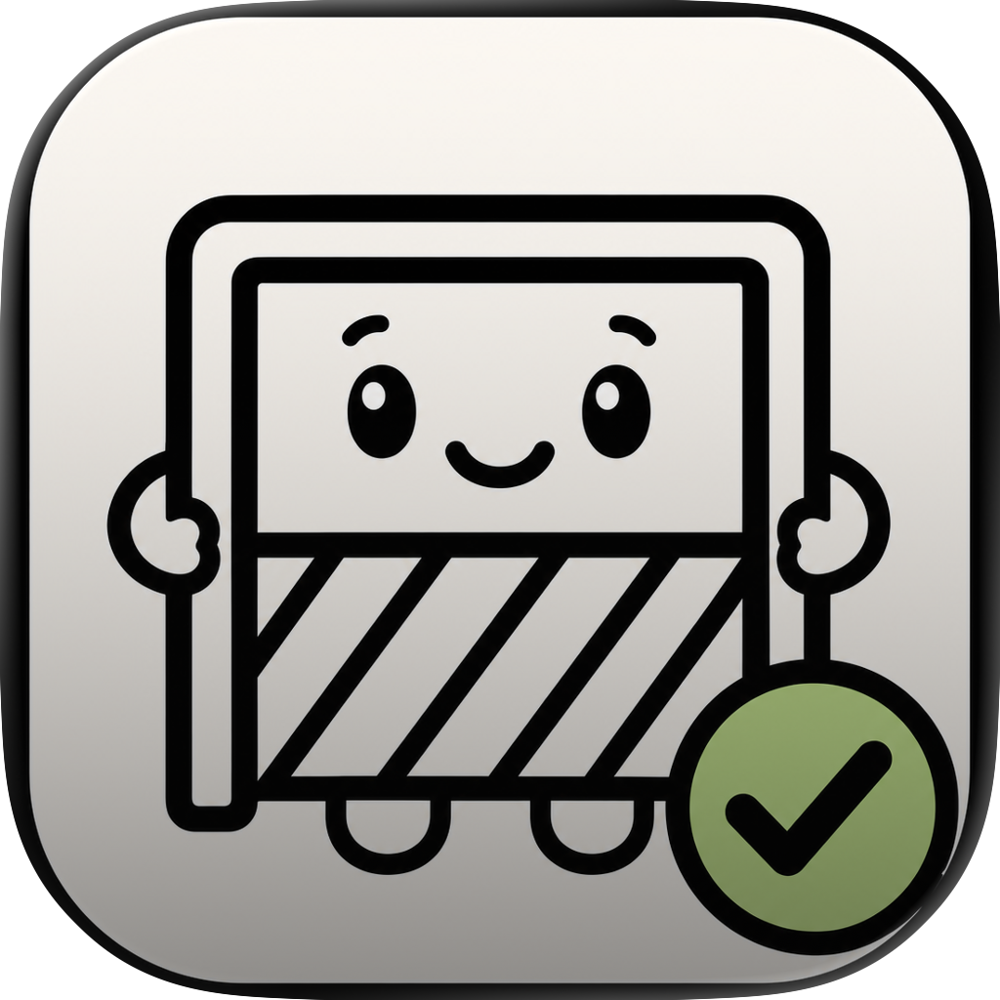

# Goalie

<p align="center">
  
</p>

**Goalie** is a Mac app that turns live trend signals into build-ready agent goals — then hands them to your local **Claude Code** or **Codex CLI**. No extra API keys. Your subscription, your machine.

Prompt it. Goal it. Build it.

## What it does

1. **Pulls signals** from the web (Google, Reddit, Hacker News, GitHub, and more).
2. **Generates goals** — 12 sharp ideas with starter prompts, tuned by your “how wild?” dial.
3. **Starts builds** — one click sends a goal to Claude Code or Codex.
4. **Saves for later** — bookmark goals when you're browsing but not ready to build.

Builds land in `~/Goalie Projects`.

## Get running (Mac)

```bash
git clone https://github.com/rachel-nocode/goalie.git
cd goalie
npm install
npm run desktop:dev
```

You'll need **Node 18+** and at least one of **Claude Code** or **Codex CLI** installed.

## Install the app (DMG)

Download the latest **Goalie** `.dmg` from [Releases](https://github.com/rachel-nocode/goalie/releases), open it, drag Goalie to Applications, and launch.

## Build from source

```bash
npm run desktop:pack      # unsigned Goalie.app in desktop-dist/
npm run desktop:release   # signed + notarized DMG in release/ (requires Apple dev cert)
```

## Browser dev mode

```bash
npm run dev
```

Open `http://localhost:3000` — handy for UI work. The Mac app is the full experience.

## Optional env vars

Copy `.env.example` → `.env.local` if you want extras:

| Variable | What it does |
|----------|--------------|
| `GROQ_API_KEY` | Cloud fallback if local CLIs can't generate goals |
| `TWITTER_BEARER_TOKEN` | Live X trend signals |
| `GITHUB_TOKEN` | Higher GitHub API limits |

Most people never need these.

## Privacy

Goalie runs locally. Saved goals, caches, and build history live in `.cache/` on your Mac — nothing is committed to git.

## License

MIT — © [Rachel nocode](https://rachelnocode.com)
